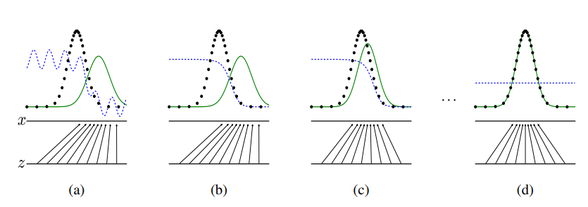
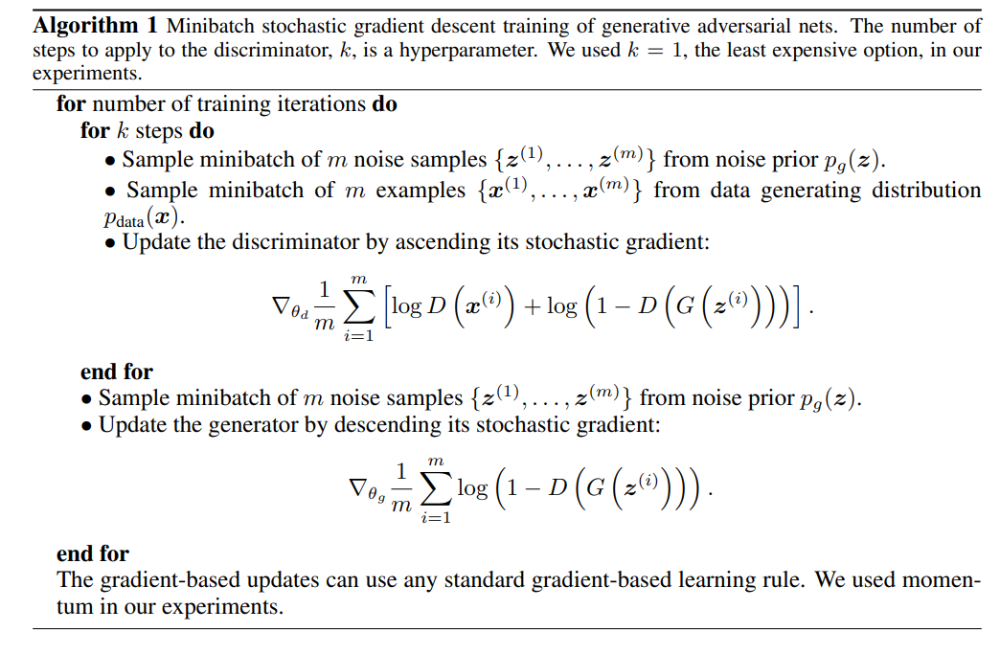
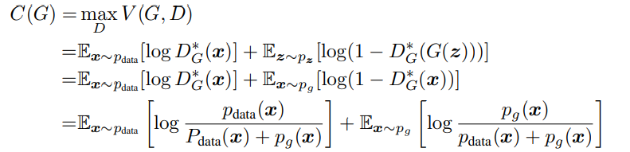

# Generative Adversarial Nets
https://proceedings.neurips.cc/paper_files/paper/2014/file/5ca3e9b122f61f8f06494c97b1afccf3-Paper.pdf

# Abstract
우린 새로운 generative model을 소개한다. Generator, Discriminator 두 신경망을 서로 적대적으로 학습시킴으로써, 최종적으로 G가 학습시키는 data들에 유사한 분포의 output을 내놓으면서, 잘 학습된 D가 training data인지 G가 generate한 data인지 구분하지 못하도록 하는 것이 목적이다. D를 학습시키기 위해 필요한 건 input되는 data가 training data인지, G가 생성한 fake data인지만 알면 되므로, 각 data에 대해 label이 필요 없는 비지도 학습이다.

# Intro
딥러닝에서, gradient가 잘 정의된 piecewise linear unit을 기반으로 backpropagation, dropout등의 algorithm을 통해  discriminative model에서 큰 성과를 이뤘다. 이에 반해 data의 분포를 학습시켜야하는 generative model은 MLE(maximum likelihood estimation)의 계산복잡도 문제나, piecewise linear unit의 이점을 generate에 활용하기 어렵다는 점에서 discrinative model보다 덜한 모습을 보였다.

(질문: MLE의 문제와 Piecewise linear unit의 이점을 왜 기존 generative problem에선 사용하기 어려웠는가?)

때문에 본 논문에선, 이런 문제들을 우회하여 해결하는 새 generative model을 제안한다.

G와 D를 각각 G = 위조지폐범, D = 위조지폐를 판별해야하는 은행직원 으로 생각할 수 있다.
D는 어떤 지폐가 input되면 그 지폐가 참인지 거짓인지 판별하고, 그 결과에 따라 더 정교해지도록 학습된다. G는 random noise를 input받아 가짜 지폐를 output한다. G에서 나온 지폐를 D가 참인지 거짓인지 판별하고, 그 결과에 따라 참인 쪽으로 판별되도록 학습시킨다.

본 논문에선 backpropagation과 dropout만 사용하고, G가 내뱉는 sample은 오직 forward propagation만 사용한다. 

# Adversarial nets

$\min_G \max_D V(D, G) = E_{x \sim p_{data}(x)}Log D(x) + E_{x \sim p_{z}(z)} Log(1-D(G(z)))$

$G(z; \theta_g)$ is differentiable function.
$D(x; \theta_d)$ outputs a single scalar.

G는 random noise의 분포 $p_z(z)$에서 z를 input받아 $p_g$를 만들고,

D는 data들의 x를 input받아 이것이 $p_{data}$로부터 온건지 $p_g$로부터 온건지 구분한다.

GAN을 학습시킨다는 것은 곧 위 공식을 사용한 minmax game을 하는 것과 같다. 다음 section에서 충분한 capacity 하에서(parametric limit이 없다면) G가 D를 속일만큼의 분포를 생성해낼 수 있음을 보인다.

finite datasets에서 overfitting이 일어나기 쉬운 관계로, 우린 D를 k번 학습시키고 G를 한번 학습시킨다.(질문: 이래놓고 k=1로 두고 학습을 시키는데, 왜그랬는지 잘 모르겠다.)

학습 초반엔 D의 성능이 G의 성능보다 훨씬 좋기 때문에 위의 식을 그대로 학습시키는 것으론 학습이 잘 되지 않는다. 즉 학습 초반엔

$log(1-D(G(z)))$이 saturate되어있다.($log (x)$ 라는 object function이 해당 상황에서 $x \in (0,1]$인 상황인데 이때 x가 0에 가까울수록 이 object function은 충분한 gradient를 갖지만 x가 1에 가까울수록 gradient가 작아지기 때문에 그런 의미에서 saturate 되어있다는 것 같다.)

때문에 G를 학습시킬 때에 $log(1-D(G(z)))$를 minimize하도록 학습시키기보다 $log(D(G(z)))$를 maximize하도록 학습시킨다. 이는 G, D dynamic에서 same fixed point를 갖지만 학습 초반에서 더 잘 작용한다.

# Theory
Generator G를 random noise 분포 $z~p(z)$으로부터 나온 확률분포 $p_g$으로 이해하자.
이 section에선 이 minimax game이 infinite capacity에서 결국 $p_g = p_{data}$라는 global optimum을 갖게 될 것을 보일 것이다.

파란 선은 D의 분포, 검은 선은 실제 data의 분포, 녹색 선은 G가 생성한 분포 $p_g$이다. 아래쪽 선 z는 z로부터 sampled된 domain이고, 위쪽 선 x는 x의 domain을 뜻한다. 화살표는 $p_z$에서 G를 통해 mapping된 분포가 어떻게 $p_g$에 mapping되는지를 보인다.

(a)에서, 수렴 근처의 G와 D의 쌍을 보자. 여기서 D는 부분적으로 정확한 분류를 한다.

(b)에서, D가 sample과 data를 구분하도록 학습시킴으로써 $D^*(x) \to \frac {P_{data}(x)} {P_{data}(x) + P_g(x)}$ 이 된다.

(c)에서, G를 학습시킨 후에 D를 통해 G의 분포가 data의 분포에 가까워지도록 한다.

(d)에서, G와 D가 충분한 capacity를 갖는다 할때, 학습을 계속 진행시키면 $p_g = p_{data}$가 되어 학습이 더이상 불가능해지게 될 것이다. 즉, D가 sample과 data에 대해 항상 $\frac{1} {2}$ 의 값만 내놓을 것이다. 

이제 algorithm을 소개한다.

data와 sample을 동시에 사용하여 D를 학습시키고, 그다음 G를 학습시킨다.
이제 이론을 보자.

# Global Optimality of $p_g = p_{data}$

먼저, 주어진 G에 대한 최적의 D를 생각해보자.

Proposition 1. For G fixed, the optimal discriminaotr D is

$D_G(x) = \frac {p_{data}(x)}{p_{data}(x) + p_g(x)}$

(즉, input data $x$에 대해 data의 분포와 sample의 분포가 멀수록 D는 더 잘 classification 한다.)

Proof.

Fixed된 G에 대해 D는 V(G,D)를 maximize하도록 학습시키는 것이 목적이다.

즉, 

$V(G, D)$

$=\int_x p_{\text{data}}(x) \log(D(x))dx + \int_z p_z(z) \log(1 - D(g(z)))dz$

$=\int_x p_{\text{data}}(x) \log(D(x)) + p_g(x) \log(1 - D(x))dx$

를 maximize하는 것이다. 여기서 위 식을 아래 식과 같이 표현할 수 있는건 Fiexd된 G에 대해 두 기댓값이 같기 때문이다. 즉

$E_{z \sim p_z(z)} \left[ \log(1 - D(G(z))) \right] = E_{x \sim p_g(x)} \left[ \log(1 - D(x)) \right]$ 이기 때문이다.

($+$ 위 부분에 대해 자세히 설명하자면, 

G가 어차피 Fixed되어있기 때문에 random noise distribution에서 하나 sampling해와서 $G(z)$에 넣는 것이나 이 random noise distribution으로부터 변환된 분포 $p_g(x)$에서 하나 sampling 하는 것이나 결국 같다는 것이다.)

위 식은 미분하면 

$D^\star_G(x) = \frac {p_{data}(x)}{p_{data}(x) + p_g(x)}$

에서 최댓값을 가지므로, 증명되었다.$\blacksquare$

(D가 $Supp(p_{data}) \cup Supp(p_g)$ 밖에서 정의될 필요가 없다고 하는데, 이게 어떻게 작용하는지는 이해가 잘 안된다.

Theorem 1을 보이기 전에, D를 훈련하는 것은 조건부확률 $P(Y = y|x)$ 를 추산하는 log-likelihood를 최대화하는 것으로도 해석할 수 있다. 이때 $Y$는 $x$가 $p_{data}$로부터 왔는지, $p_g$로부터 왔는지에 대한 확률을 의미한다. 

Theorem 1. The global minimum of the virtual training criterion $C(G)$ is achieved if and only if $p_g = p_{data}$. At that point, $C(G)$ achieves the value $−log 4$.

Proof. 

$C(G) =$

$\int_x p_{data}(x) log \frac {p_{data}(x)}{p_{data}(x)+p_g(x)} + \int_x p_{g}(x) log \frac {p_{data}(x)}{p_{data}(x)+p_g(x)} =$

$= -log4 + KL(p_{data} || \frac {p_{data}(x)+p_g}{2}) + KL(p_{g} || \frac {p_{data}(x)+p_g}{2}) =$

$-log4 + 2 \cdot JSD(p_{data} || p_g)$
by Jenson-Shannon divergence.

이때, Jenson-Shannon divergence에 따라 $p_{data} = p_g$ 일때에만 JSD가 0이 되므로, 이때 C(G)가 최솟값을 갖고 그 값은 $-log4$이다. $\blacksquare$

위 명제와 정리를 통해 Gan의 Global Optim을 증명했다. 이제 논문에서 제시한 알고리즘을 통해 Converge하는지를 살펴보겠다.

Proposition 2. 

If $G$ and $D$ have enough capacity, and at each step of Algorithm 1, the discriminator is allowed to reach its optimum given $G$, and $p_g$ is updated so as to improve the criterion
$E_{x∼p_{data}}[log D^\star_G(x)] + E_{x∼p_g}[log(1 − D^\star_G(x))]$
then $p_g$ converges to $p_{data}$

Proof.

$p_g$에 대한 함수를 $V(G,D) = U(p_g,D)$이라 하자. 여기서 $U$는 $p_g$에서 convex하다.(왜?)

convex fucntions의 supremum에서의 subderivatives은 함수가 최댓값을 가지는 점에서의 미분을 포함한다. 즉, 

만약 $f(x) = sup_{\alpha \in A} f_\alpha(x)$ 이고, $f_\alpha(x)$가 모든 $\alpha$에 대해 $x$에서 convex하면,
$\partial f_\beta(x) \in \partial f$ if $\beta = arg sup_{\alpha \in A}f_\alpha(x)$ 이다.(이거에 대한 증명은 없는것같다. 직접 해보고 추가해야겠다.)

이제 D에 대한 U의 상한이 $p_g$에서 convex하고, Thm 1에 따라 unique global optima를 갖는다. 그러므로 충분히 작게 $p_g$를 update하는 것으로, $p_x$로 수렴시킬 수 있다. $\blacksquare$

이로써 GAN 논문을 공부해보았다. 증명하면서 수학적으로 헷갈리는 부분들에 대해 더 자세히 공부하고, 추가해야겠다.

해석학을 왜 배우는지 알거같다. 이제 GAN의 variation들을 공부한다.
