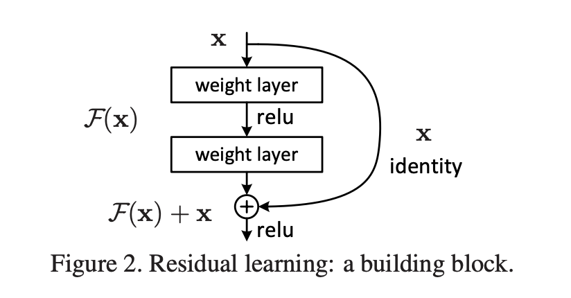
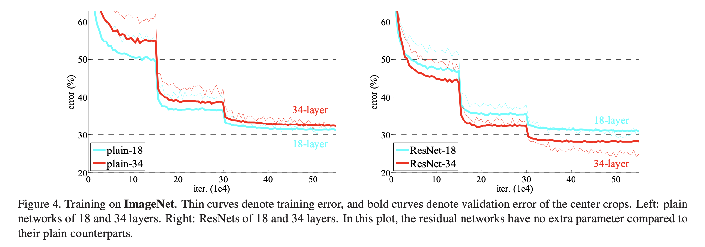

# Paper review : Residual Net
해당 논문은 degradation을 해결하는 새로운 신경망을 소개한다.

degradation은 gradient vanishing이나 overfitting과 다르게, 수렴이 되기는 하지만 어떤 epoch에서 Shallow Network보다 Deep Networt에서 traning error가 더 큰 문제다. 신경망에서 Depth의 중요성이 대두되는 시점에 이는 큰 문제고, 본 논문에선 Residual이라는 method를 통해 이를 해결한다.

생각보다 많이 어려운 내용이었다. 그럼에도 수학적인 내용이 별로 없는데, 스스로 해보겠다.

# Abstract
Residual Net 이라는걸 만들었다. Residual, 잔차를 이용하여 학습시키는 것이다.

본 논문에선 이 Residual Net이 Deep한 신경망에서 보다 더 optim하기 좋음을 보이고,
DCNN에서 갖는 문제를 해결한다.

# Intro

DCNN이 등장하여 image classification은 큰 성과를 얻을 수 있었다.
Deeg한 layer를 통해 visual의 여러 분야에서 좋은 효과를 많이 보면서 신경망에서 Deep의 정도는 더욱 중요하게 되었다.

그에 따라 이런 질문을 할 수 있다.

> "Is learning better networks as easy as stacking more layers?"

이 질문에 대한 답을 내리는 데에 방해되는 vanishing/exploding gradients과 같은 문제들이 있었지만,

normalization과 SGD등과 같은 여러 방법들로 크게 해결되었다.(이들은 수렴이 시작부터 안되는 문제에 해당한다.)

수렴이 되긴 하지만 동일 epoch에서 Accuracy가 Deep Network에서 layer가 많을수록 accuracy가 떨어지는 현상이 일어나는데, 이를 degradation problem이라 부른다.

이는 overfitting과는 별개의 현상으로, overfitting은 train error는 줄어드는 반면 과적합하게 학습되어 test error가 커지는 것인데, degradation problem에선 train error와 test error가 둘 다 크게 나타난다. 

(test error가 큰 것보다 사실 train error가 큰게 진짜 문제다.)

이 현상은 모든 system( = Networkd?)을 optimize하는게 쉽지 않다는 것을 보여준다.

이제 shallow한 신경망과 그에 대응되어 layer를 추가한 deep한 신경망을 생각하자. 이때, deep net은 shallow net에 대해 특정한 규칙을 갖고 layer를 추가하게 된다. identity mapping이다. Add layer 외에는 shallow net에서 learned layer를 가져와 그대로 사용한다.

이떄 Net들의 solution이 존재한다면, Deep net이 Shallow net에 비해 더 낫거나, 적어도 덜한 성능을 보이진 않아야 한다. 그런데 우리의 실험에서, 지금의 solver(=Deep Net)은 shallow net에 비해 더 나은 solution을 찾아내지 못한다.

본 논문에선 Residual layer를 사용하여 이 degradation을 해결하는 것을 다룬다.

어떤 layer에서 original mapping을 $H(x)$라 하자. 여기에 $F(x) = H(x) - x$ 라는 layer를 추가한다. 그럼 origin mapping $H(x) = F(x) + x$가 된다. 이렇게 신경망을 구성하면 origin net에 비해 optimize하기 더 쉬울 것이다. 이런 식으로 layer를 구성하는 것을 shortcut connections 이라 한다. 

이 방법은 solver를 수정할 필요도 없고, complexity가 증가하지도 않으며 parameter가 증가하지도 않다.

본 논문에서, 다음 두가지를 보인다.

> 1) 우리가 만든 extremely deep residual net은 optimize하기 쉽지만, 이에 대응되는 plain net은 높은 train error를 보인다.
> 2) 우리가 만든 extremely deep residual net은 depth가 커지면 커질수록 더 나은 성능을 보인다. 이는 plain에 비해 실질적으로 낫다.

이후는 ResNet이 대회나가서 다 이겨버렸다는 내용. 좋겠다

# Deep Residual Learning
## Residual Learning
시작하기에 앞서, Asymptotic analysis에 대한 간단한 개념을 정리하고 시작한다.

Definition of Asymptotically equivalent:

If and only if $\frac{f(x)}{g(x)} \to 1$, then $f(x)$ and $g(x)$ are said to be asymptotically equivalent.

(Asymptotically convergence 에 대한 내용은 잘 못찾겠다.)

여러개의 non-linear layer로 구성된 신경망이 어떤 복잡한 함수에 asymptotical하게 근사할 수 있다는 가정을 세우면, 이것은 곧 여러개의 non-linear layer로 구성된 신경망이 residual function(= $H(x) - x$, 이때 input과 output의 dimension은 같다고 가정)에 asymptotical하게 근사할 수 있다는 것과 같다.
original function이 $H(x) = F(x) + x$이건 $H(x) = F(x)$이건 asymptotically approximate 할 수 있다는 것은 같지만, ResNet이 더 잘 된다는 데에서 차이가 발생한다. 

실제로 identity mapping이 optimal인 경우는 거의 없지만, 이 방식은 문제 해결을 돕기 위한 preconditioning이 되어준다. 

## Identity Mapping by Shortcuts

building block을 다음과 같이 정의한다.

$y = F(x, \{W_i\})+ x$ ($x = input,\text{ } y = output$)

Plain Net과 ResNet의 computational cost를 계산해봤는데, 똑같게 나왔다.(똑같을 수는 없지 않나, 모르겠다)

$y = F(x, \{W_i\})+ x$ 여기서 $x$와 $y$의 dimension이 다를 수 있는데, 이땐 $W_s$를 곱해주어 해결한다.

## Network Architectures
제일 바라던 부분이다. 구조를 자세히 공부해보고, 왜 더 잘 되는가를 생각해보자.

### Plain Network
일반적인 CNN을 Deep하게 쌓고, 이후 avg pool해서 fc에 연결.

### Residual Network
CNN을 Deep하게 쌓되, CNN layer들은 Residual을 적용한다. 이후 avg pool해서 fc에 연결.

이후 내용은 실험을 했고, 결과가 좋았다는 내용.

해당 신경망의 핵심은 이것이다. 높은 epoch에서 Deep할수록 degradation이 되어 Deep할수록 Train error가 커졌었는데, ResNet에선 이것이 역전되어 Deep할수록 더 나은 성능을 보인다는 것.

이제 직접 ResNet을 구현해보고, 실험해보고, 가능하다면 왜 더 잘되는지 파악해보자.
