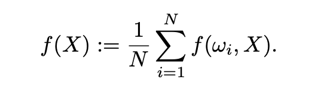

# Study for SGD

Question.
모든 상황에 대해 항상 좋은 Optimizer가 존재하는가?

이 질문에 대한 답을 위해 SGD부터 Adam까지 공부한다.

$+$ Layer별로 학습을 다르게 한다면 에 대한 연구도 있을까?

study paper list:
1) The convergence of the Stochastic Gradient Descent (SGD) : a self-contained proof
https://arxiv.org/pdf/2103.14350.pdf
최신 논문이고, 가벼워보여 선택했다.

2) Stochastic Runge-Kutta methods and adaptive SGD-G2 stochastic gradient descent
https://ieeexplore.ieee.org/stamp/stamp.jsp?arnumber=9412831&tag=1 1) 논문과 같은 저자다. 

3) Stochastic Gradient Descent Tricks   
https://www.microsoft.com/en-us/research/wp-content/uploads/2012/01/tricks-2012.pdf

4) ADAM: A METHOD FOR STOCHASTIC OPTIMIZATION
https://arxiv.org/pdf/1412.6980.pdf
# Summary of 1) The convergence of the Stochastic Gradient Descent (SGD) : a self-contained proof

위와 같은 셋팅을 생각하자.

 
이때 위 조건을 만족하면,

 
위 Thrm이 성립한다.

요약하자면 단순하게 구성된 FNN에서, learning rate를 highper-parameter로 지정한 backpropagation으로 특정 상황에서 수렴하는 것을 증명한 것이다.

이때 수렴하는 조건으로, (3)에선 $\nabla L(w,X)$이 발산하지 않는 상황을, (4)에선 strongly convex한 setting을 상정하고 있다. 이는 gradient desent의 수렴을 생각할 때에 고려야해야 할 조건이다. non-convex하면 local minimum에 빠질 수 있고, gradient가 발산한다면 발산하는 지점에서 학습이 망가져버리기 때문이다.

Thm 1-1에서, $X_*$이 unique한 solution이 exist하다고 말하고 있는데, 이는 strong convexity와 smoothness 가 $L$에서 보장되기 떄문이다. 여기서 잠깐 몇 개념에 대해 정리하고 넘어간다.

 Lipschitz smoothness(K-Lipschitz):
 
 There exist $K$ such that $|f(x_1; \theta) - f(x_2; \theta)|$ < $K|x_1-x_2|$ for all $x_k \in X$, then f is Lipschitz smoothness on $X$.
 
Strong Convex:

$f(y) \geq f(x) + \nabla f(x)^T (y - x) + \frac{m}{2} \|y - x\|^2$ ($m$ = 0일때 convex)

가정에서 $L$의 gradient가 발산하지 않음을 전제했기 때문에, Lipschitz smoothness가 만족된다.

흥미로운 부분은 Thm 1.4 부분이다. $\rho_n$이 수렴하고 $\sum \rho_n = ∞$일때(ex. $\rho_n = \frac{1}{n}$) $d_n \to 0$이면 $L2$ norm에서 $X_n \to X_*$가 만족된다는 것이다. Thm 1-1,2,3을 통해 1-4를 증명한다.

증명이 쉬울줄알았는데 생각보다 쉽지 않았다. 논리 자체가 어렵진 않았는데 왜 이렇게 설정하는가 에 대한 의문이 많이 들었다. 증명을 이해하고 나서 두개의 의문이 생긴다. 

1) Strong convex함이 증명에서 사용되었다. Strong convex한 함수는 convex한 함수와 정확히 무엇이 구별되며, Strong하지는 않은 상황에선 어떻게 되는가?
2) Thm 1-4에서 $\sum \rho_n = ∞$이 보장되었기에 수렴성이 증명되었다. 보장되지 않을땐 어떻게 되는가? 
두 질문을 바로 해결해보기 전에, 증명을 정리하자.

 

 

보기 편하게 옮겨적으려 했는데 그러기엔 너무 기호가 많았다.

먼저, strong convex하다는게 정확히 무엇인가? convex는 주어진 domain에서 아래로 볼록한 것을 의미한다.
(https://www.princeton.edu/~aaa/Public/Teaching/ORF523/S16/ORF523_S16_Lec7_gh.pdf, convex에 대한 자세한 내용은 링크 참조)

$\forall x, y \in R^n, ∃ m>0 \text{ such that } f(y) \geq f(x) + \nabla f(x)^T (y - x) + \frac{m}{2} \|y - x\|^2$ ($m$ = 0일때 convex)

이 식을 다르게 적으면 $y > x$일때

$\frac{f(y) - f(x)}{y - x} \geq \nabla f(x)^T + \frac{m}{2}{(y - x)}$

즉 $m$ > 0인 m 이 존재하여 모든 $x, y$에 대해 위 식을 만족한다는 것은

$f(tx+(1−t)y)≤tf(x)+(1−t)f(y)−t(1−t) \frac{m}{2}‖x−y‖^2$, α∈[0,1].

이것과 동치가 되는데 두 점의 중점보다 그 중점의 함수값이 더 작아야 하는 기존 convex의 조건보다 더 강하게, 더 smooth하게 만드는 조건인 것으로 이해된다. Strong convex하면 convex한건 당연히 보장된다.

convex하면 $∇^2f(x) \geq 0, \forall x \in dom(f)$이 만족하고, 
strong convex하면 $∇^2f(x) \geq mI, \forall x \in dom(f)$ 이 된다

strong convex가 되게 특이한 조건일줄 알았는데, convex한것보다 특별하진 않은 것 같다. 신경망에서 convex한 상황을 만드는게 훨씬 어려울 것 같다.

# Summary of 2) Stochastic Runge-Kutta methods and adaptive SGD-G2 stochastic gradient descent
Euler method의 변형인 Runge-Kutta method를 응용한 SGD 방식을 소개한다. 학습률을 Runge-Kutta method를 통해 스스로 조절하는, momentum SGD 같은 느낌인 것 같은데, 읽어봐야 알겠다.

## Abstract ~ Intro
Optimization algorithm은 Deep Learning의 핵심이다. SGD가 고안되어 사용된 이후로, SGD를 발전시킨 여러 method들이 등장하였다. 대표적으로 Adam과 같이 momentum을 적용하여 Learning rate를 조절하여 학습 속도를 빠르게 하는 방법이 있다.(Adam에선 학습속도를 조절하는 momentum과 학습 방향을 조절하는 AdaGrad가 융합해 있다.)

본 논문에선 Runge-Kutta method를 SGD에 접목시킨 새로운 Gradient method, SGD-G2를 소개한다.
## Notation

Loss Function을 위와 같이 정의하자. 여기서 $\omega_i$는 이산적인 값을 갖는 probability space의 원소이고, $X$는 우리가 학습시켜야 하는 parameter다.

$\Omega = \{\omega_1, ..., \omega_N\}$, $f_i = f(\omega_i, \cdot)$.

Deterministic procedure of gradient desent:

$X_{n+1} = X_n - h\nabla f(X_N)$  ($h$ is Learning Rate)

batch size = train dataset size인 상황이다. 이는 몹시 비효율적이기에,

SGD:

$X_{n+1} = X_n - h\nabla f_{\gamma_n}(X_N)$  ($\gamma_n$ is uniform variables.)

이렇게 해서 dataset에서 일부만 가져와 학습시키면 전체 dataset이 크더라도 학습 속도에 큰 영향을 주지 않기에 효율적이다.

## The construction of the SGD-G2 algorithm: the principle

우리가 하고 싶은 것은 parameter $X_n$을 minimize하는 것이다. 이 $X_n$은 시간에 영향을 받아 flow?하므로 $t_{n+1} = (n+1)h: X_{n+1} ≃ X(t_{n+1})$ 과 같이 표현된다. $t$에 의존하는 $X_n$을 approximate 하는 많은 방법이 존재하지만, 그중 하나로 Runge-Kutta schemes를 사용할 수 있다. 

$Y_0 = X(0)$,

$\tilde{Y}_{n+1} = Y_n - h \cdot \nabla f_{\gamma_n} (Y_n)$

$Y_{n+1} = Y_n - \frac{h}{2}[\nabla f_{\gamma_n} (Y_n) + \nabla f_{\gamma_n} (\tilde{Y}_{n+1})]$.

시간이 없어서 여기까지, 이후에 시간이 나면 더 봐보자. 아담도 봐야한다.

# ADAM: A METHOD FOR STOCHASTIC OPTIMIZATION

# 고찰

Consider 2-Layer FNN, such as $f_n(x;\theta) = \sum (W_k \cdot max(x+b_k, 0) + c_k)$, then $f_n$ satisfy following property

1) $f_n$ can converges uniformly for any continuous function with large enough N.
2) $f_n$ is continuous on $X$ ($X$ is domain of $x$.)

