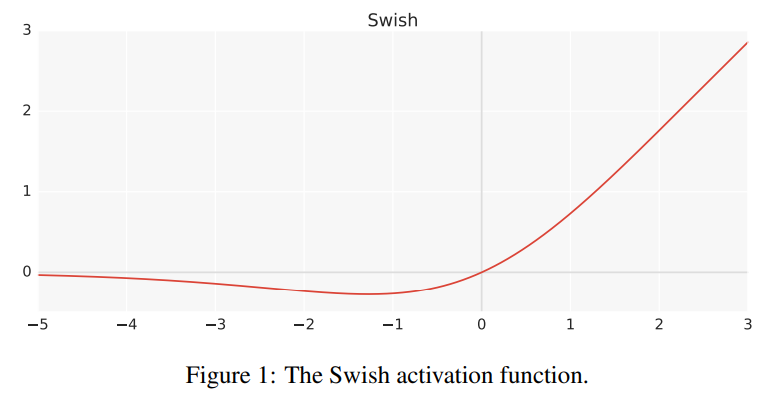
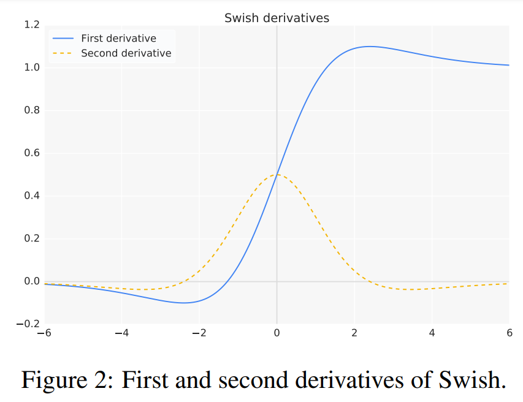

# Paper review: Swish
Swish: a Self-Gated Activation Function

https://arxiv.org/pdf/1710.05941v1.pdf

# Abstract
Relu = $max(x,0)$는 현재 가장 범용성있게 사용되는 효과적인 Active function이다.

이외에 여러 Active function이 등장했지만, Relu만큼이나 범용적이고 효과적인 Active function은 없었다. 때문에 본 논문에선 Swish라는 새로운 Acitve function을 소개한다.

# Intro
Deep Neural Network의 핵심은 Non-linear active function을 통해 Linear transform하는 것이다. 
가장 흔하게 쓰이고 있는건 Relu이며, 이는 기존에 사용되던 Sigmoid나 tanh에 비해 optimize가 잘되는데, 이는 Relu에 들어가는 input이 0보다 클 때, gradient flow가 잘 되기 떄문이다. 

Relu가 가진 단순함과 신뢰성, 그리고 여러 모델과 데이터셋에 대해 consistent한 성질이 인정받아 Deep learning을 다루는 사람들이 가장 선호한다. 

우린 Swish라는 새 Activation function을 만들었다. 이는 이미지분류, 자연어처리 등에서 Relu를 능가하는 성능을 보인다.

# Swish

$f(x) = x \cdot \sigma(x)$

$= x \cdot sigmoid$

$= \frac {x} {1+ e^{-x}}$

The derivative of Swish

$f'(x) = f(x)+ \sigma \cdot (1-f(x))$

Swish는 bounded below, unbounded above 하다는 점에서 Relu와 유사하지만,

smooth하고 non-monotonic하다는 점에서 Relu와, 그리고 기존의 많은 Activation function들과 차이를 갖는다.(smooth하다 = 연속함수를 무한번 미분해도 연속이다)

Swish의 도함수 그래프에서 볼 수 있듯이, Swish는 x>0일때 기울기가 1 이상인 Relu의 특성을 보존한다. 이후 실험 파트에서, BatchNorm을 사용할때 Swish는 Relu보다 더 깊은 신경망을 학습시킬 수 있음을 보인다.

Swish에 trainable한 $\beta$를 parameter로 추가하면

$f(x; β) = 2x · σ(βx)$

처럼 쓸 수 있는데, 이때 $\beta=0$이면 그냥 Linear function이 되고, $\beta \to \infty$이면 Relu와 같아진다.
따라서 이런 $Swish - \beta$를 Linear function과 Relu 사이에서 비선형보간하는 것으로 볼 수 있다.

Swish를 Relu로 대체하는 것은 신경망에서 Relu 대신 Swish로 교체하기만 하면 되기 때문에 간단하다.(Relu보다 학습률은 조금 낮춰하는게 잘 되는 것을 확인했다.)

# PROPERTIES OF SWISH

우리 실험에선 Swish가 Relu에 비교해서 우수하다는 것을 보인다. 어떤 Activation function이 다른 Activation function보다 우수하다는 것을 보이는건, 학습이 여러 요인에 영향받기에 어려운 일이다. 하지만 unbounded above, bounded below, non-monotonic, and smooth한 Swish의 성질이 모두 이점을 갖는다 믿는다.

Swish는 non-monotonicity하기 때문에 Relu나 다른 Activation function에 비해 initialization and learning rate에 덜 영향받는다.

Swish는 smooth하기 때문에 Relu에 비해 더 optimize하기 좋고 initialization and learning rate에 대해 덜 민감하게 작용한다.

이후는 실험.

# 고찰
이래저래로 좋다..고는 하는데 왜 좋다는지 사실 잘 모르겠다.
Relu를 충분히 깊게 쌓는 것으로 임의의 연속함수를 표현할 수 있기 때문에 어떤 연속 활성화함수를 사용하더라도 Relu를 쓰는 것과 큰 차이가 없을 거라는 추측을 했었는데, smooth한 성질이 정말 Relu에 비해 더 좋은 결과를 내는게 맞을까? smooth하기 때문에 더 optimize하기 좋다는게 이해가 잘 되지 않는다. 

또, Relu를 깊게 쌓는 것으로 연속 활성화함수를 사용하는 것과 같은 효과를 내는 해가 존재하더라도, 기존의 gradient desent로 그 최적 해를 찾아낼 수 있느냐? 는 다른 문제이기에, 생각해봐야 할 문제인 것 같다.
