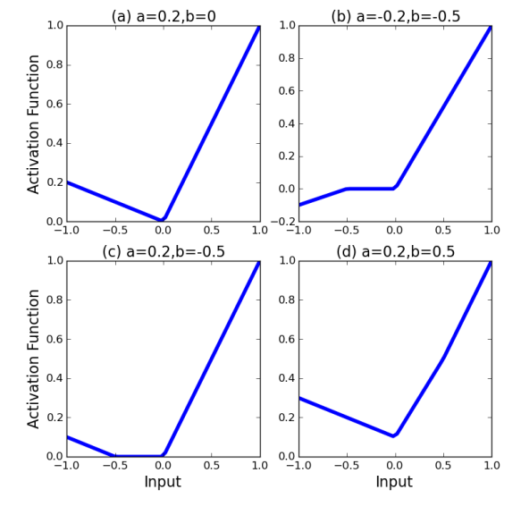
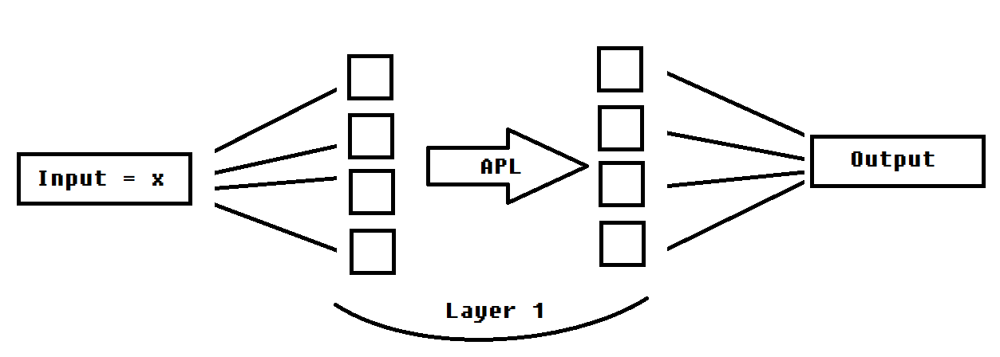
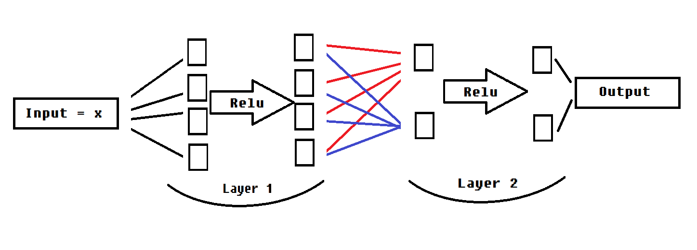

#Paper review: LEARNING ACTIVATION FUNCTIONS TO IMPROVE DEEP NEURAL NETWORKS
https://arxiv.org/pdf/1412.6830.pdf

1. 개요

일반적으로 ANN은 Fixed된 Active function을 사용한다. 정확하고 빠른 학습이 가능한 Active function을 찾는건 활발히 연구중인 주제다. 본 논문에서는 학습이 가능한 Active function을 정의하고, 이를 사용해 실험한 결과를 소개한다.

2. APL: ADAPTIVE PIECEWISE LINEAR UNITS

새로운 Active function을 다음과 같이 정의하자.

$$h_i(x) = \max(x, 0) + \sum_{s=1}^{S} a_i^s \cdot \max(-x + b_i^s, 0)$$

이때, a는 구간 내 기울기를 결정하고, b는 구간의 경계점을 결정한다.
이 Active function을 사용해 만든 신경망은 2SM개의 a,b parameter를 학습시켜야 한다. 이때 M은 hidden layer의 node 갯수이며, 이는 기존 parameter인 weight와 bias에 비하면 작다.
n번째 hidden layer의 node 갯수를 $d_n$개라 하면 이때의 weight와 bias 갯수는

$$\sum_{k=0}^{n} d_{k+1} \cdot (d_{k}+1)$$ 이 되므로 이는 

$$2SM = 2S \cdot \sum_{k=0}^{n} d_k$$ 에 비하면 훨씬 크다. 

(해당 부분은 이렇게 정의한 새로운 Active function이 신경망의 연산량에 큰 영향을 주지 않는다고 말하고 싶었던 것 같다.)

Theorem: 

$h_i(x)$는 다음 조건을 만족하는 임의의 piecewise linear function을 모두 표현할 수 있다.

1) $\forall x \geq u, \exists u \text{ such that }$ g(x) = x
2) $\forall x < v, \exists v$, $\alpha$ $\text{ such that }$ $\nabla$ g(x) = $\alpha$

증명은 간단하니 생략한다. 또, 충분히 큰 S에 존재하여 $h_i(x)$가 임의의 연속함수에 대해 근사 가능하다.

S=1, 2로 두고 APL을 학습시킨 예시. 

의문점: hidden layer를 늘리는 것과 학습가능한 Active function을 사용하는 것의 차이가 무엇인가.
예시로 APL을 적용한 2-depth NN을 구성해보겠다.

layer1의 node 갯수를 $d_1$ 이라 하자.

위와 같이 구성된 신경망에서, hidden layer의 각 node들은 독립적인 APL을 Active function으로 갖는다. S=1이라 하자. 이때 각 APL은 최대 S+1개의 hinge point(꺾이는 점?)를 갖는다.
여기서 학습시켜야 할 parameter는 $2S\cdot d_1 + d_0 \cdot d_1 + d_1 + d_1 \cdot d_2 + d_2$개가 된다.
그럼 이때 expressivity는 어떻게 되는가?
Acitve function이 Relu라면, input size와 outputsize가 1일때 memorization capacity는 $d_1$이 되고 이는 hinge point(=layer1의 node)의 개수와 같다. APL을 사용한 상황에서, S=1일때 APL은 최대 3개의 piece를 갖는 piecewise linear가 되고, 이때의 expressivity는 $2\cdot d_1$이 된다. 귀납적으로 2-depth APL 신경망은 $(S+1)\cdot d_1$의 memorization capacity를 갖는 신경망이 된다.

이제 APL을 사용하지 않고, 대신 3-depth layer Relu 신경망을 생각하자.

이 신경망에서, parameter의 갯수는 $d_0 \cdot d_1 + d_1 + d_1 \cdot d_2 + d_2 + d_2 \cdot d_3 + d_3$개이다. APL과 Relu 두 신경망 모두 input과 output의 node, 즉 $d_0, d_2(APL), d_3(Relu) = 1$ 이라 하자.즉 APL의 경우 실질적으로 expressivity에 관여하는건 $d_1$와 active function(APL), Relu의 경우 $d_1$과 $d_2$이다. Relu의 경우, $layer_2$가 APL에서의 Adoptive active function의 역할을 하므로, $d_2$ = S 라 하자. 그럼 이 setting에 맞춰 parameter의 갯수를 다시 보면

APL의 경우: $2Sd_1 + d_0 \cdot d_1 + d_1 + d_1 \cdot d_2 + d_2$

= $(2S + 3) \cdot d_1$ + 1

Relu의 경우: $d_0 \cdot d_1 + d_1 + d_1 \cdot d_2 + d_2 + d_2 \cdot d_3 + d_3$

= $(2+S)\cdot d_1 + 2S + 1$

이 되고, S가 논문에서 비교적 작게 설정한 것을 고려하면, Relu의 경우가 APL의 경우에 비해 parameter가 현저히 적다는 것을 알 수 있다. 이때 Relu의 memorization capacity는 $S\cdot d_1$이 된다. 

그렇다면 굳이 active function을 학습시키지 않아도, hideen layer를 한 층 늘리는 것만으로 더 적은 파라미터로 같은 효과를 얻어낼 수 있는데 왜 굳이 APL이 필요한 것인가? 여기서 나아가 어떤 continous piecewise linear function을 Active function으로 사용해도 Relu 신경망에서 layer를 깊게 쌓으면 같은 효과를 얻을 수 있을 것으로 추측할 수 있다.

여기서 발상을 연장해 non-linear function에 근사할 수 있는 2-layer(depth = 2) 신경망을 구상해보자. 만약 active function이 $(u_a(x) - u_b(x)) \cdot x$ (u = Unit step function)이고, 이때 a와 b가 각 node별로 독립적인 parameter라 하자. 그럼 input이 1차원일때 weight와 bias가 input에 적용되어 1차원 input에 대해 어떤 선형함수를 표현할 수 있고, active function $(u_a(x) - u_b(x)) \cdot x$ 을 통해 이 선형함수가 어떤 구간에서 선형함수를 1을 출력하고 그 외에 구간에서 0이 출력되도록 할 수 있다. 여기에 다시 weight와 bias를 적용해 최종적인 output에선 $d_1$개의 불연속점을 갖는 함수를 만들 수 있다. 이 신경망에서 node의 수가 충분히 크면, 유한 불연속점을 갖는 임의의 함수에 근사시킬 수 있다.

여기서도 Active function을 학습시키는 대신, 같은 효과를 낼 수 있는 3-layer 신경망을 구상하자.
첫번째 layer는 Relu, 두번째 layer는 $(u_0(x) - u_1(x)) \cdot x$ 으로 두자. 그럼 첫번째 layer에서 Relu를 적용시킨 뒤에 나온 값들의 합은 input에 대해 최대 $d_1$개의 불연속점을 갖는 함수가 된다. 이를 $L_1^k(x)$라 하자(이는 1번째 Layer 값들을 2번째 Layer의 k번째 노드로 보낸 값을 의미한다.). 2번째 layer로 보내 Active function으로 $(u_0(x) - u_1(x)) \cdot x$을 적용하면 $(u_0(L_1^k(x)) - u_1(L_1^k(x))) \cdot L_1^k(x)$이 되고, 이때 여기에 도달하기까지의 parameter들을 조절하는 것은 $(u_0(L_1^k(x)) - u_1(L_1^k(x))) \cdot L_1^k(x)$이 어느 구간 에서 x를 출력하고 어느 구간에서 0을 출력하게 할지 결정할 수 있다는 것이다. 2번째 Layer의 각 노드들은 이렇게 원하는 구간에서 identity function이 될지 결정할 수 있고, 이 값들에 weigth와 bias를 적용하여 output으로 보내면 원하는 불연속함수를 만들 수 있게 된다.

    def forward(self, x):
        k = 1
        for layer in self.fc[0:k]:
            x = layer(x)
            x = torch.relu(x)
        for layer in self.fc[k:k+1]:
            x = layer(x)
            x = uncontinuous(x)
        for layer in self.fc[k+1:-1]:
            x = layer(x)
            x = torch.relu(x)
(uncontinuous(x) = ($u_0(x) - u_1(x)) \cdot x$)

위와 같이 신경망을 구성하고, Mnist dataset 에 대해 실험했을 때

일반적인 3-Layer Relu신경망에서

$Layer_1$의 node 수 = 512, $Layer_2$의 node 수 = 512 뒀을 때와

위처럼 구성한 신경망에서

$Layer_1$의 node 수 = 200, $Layer_2$의 node 수 = 1250 뒀을 때

낮은 epcoh에서 비슷한 성능을 보였고, 연산 속도는 후자가 빨랐다.

그런데 높은 epoch에서 일반적인 Relu 신경망은 98%의 정확도 근처로 수렴하는 반면, Uncontinous 신경망에선 낮은 epoch에선 정확도가 96%에 있다가 5 epoch부터 60%까지 떨어지는 것을 보였다. 그 이유와 해결방법을 지금부터 생각해야한다.

Relu를 한 층 더 씌워주니 해결되었다.
왜 되는지는 자고나서 생각해보자.

더 높은 Epoch에서 다시 정확도가 떨어진다. 왜 그럴까.
